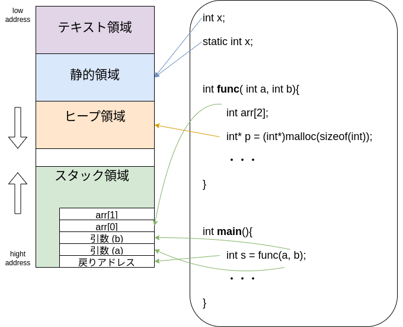

# C/C++ メモリ管理

## 1. メモリ領域の全体像
 <figure style="text-align:center;">

<figcaption>図１　メモリ領域の全体像</figcaption>
</figure>

各領域の役割は以下の通り。

- **テキスト領域**：プログラム命令（機械語）が格納される。 CPU がこの命令順に実行してプログラムが動作する。
- **静的領域**：グローバル変数などの静的変数が置かれる。プログラム開始から終了まで存続。
- **ヒープ領域**：メモリの動的管理 (C 言語の malloc 関数や C++ の new 演算子でメモリを確保すること) で用いられる。手動管理のため解放操作が必要。
- **スタック領域**：ローカル変数（自動変数）や呼び出し関数の戻り値、引数が置かれる。自動管理のためスコープ終了時に自動的に解放される。

## 2. C のメモリ管理
### 2.1 スタック変数
- 自動的にスコープ終了時に解放される
```c
int func(int a int* b){
    int x = 10;
    int arr[5];

    return x
}
```

### 2.2 ヒープ変数
- `malloc`/`free` を組み合わせる必要がある
- 初期化やエラー処理は自分で行う
```c
int* p = (int*)malloc(5 * sizeof(int));
if (p == NULL) {
    fprintf(stderr, "メモリ確保に失敗しました\n");
    return 1; // 異常終了
}
free(p);
```

## 3. C++ のメモリ管理
### 3.1 スタック変数
- 自動的にスコープ終了時に解放される
```c++
Foo foo; // ctor/dtor 自動呼び出し
```
### 3.2 ヒープ変数
- `new`/`delete` を組み合わせる必要がある
- 初期化やエラー処理は自分で行う
- 配列を確保するときは `new[]` / `delete[]` を使う。
```c++
Foo* p = new(std::nothrow) Foo();
if (p == nullptr) {
    std::cerr << "メモリ確保に失敗しました" << std::endl;
} else {
    // ...利用...
    delete p;
}

Foo* arr = new Foo[10];   // Fooの配列を10個分確保
delete[] arr;             // 配列解放
```

### 3.3 スマートポインタ
- ヒープ領域に確保したメモリを自動的に解放するクラス
```c++
std::shared_ptr<Foo> sp = std::make_shared<Foo>();
```
#### 3.3.1 参照カウンタ
##### 参照カウンタが増えるとき
1. 新しい shared_ptr が同じオブジェクトを所有するとき
   ```c++
    auto sp1 = std::make_shared<int>(42);
    auto sp2 = sp1;  // 参照カウント +1

    // use_count() == 2
   ```

2. 関数に値渡しされたとき
   ```c++
   void foo(std::shared_ptr<int> p) {
       // use_count() == 2
       std::cout << p.use_count() << std::endl;
   }
   auto sp = std::make_shared<int>(42);
   foo(sp); // 引数でカウンタ +1
   ```

3. 関数の戻り値で返されたとき
   ```c++
   std::shared_ptr<int> makePtr() {
       return std::make_shared<int>(99); // 呼び出し元に所有権が移る
   }
   auto sp = makePtr(); // use_count == 1
   ```

##### 参照カウンタが減るとき
1. shared_ptr がスコープを抜けたとき
   ```c++
   {
       auto sp = std::make_shared<int>(42);
   } // スコープ終了 → use_count -1
   ```

2. 代入で別のポインタを持つようになったとき
   ```c++
   auto sp1 = std::make_shared<int>(42);
   auto sp2 = std::make_shared<int>(100);
   sp1 = sp2; // sp1 が 42 を解放、100 を共有 (カウント増減)
   ```

3. 明示的にリセットしたとき
   ```c++
   auto sp = std::make_shared<int>(42);
   sp.reset(); // use_count -1 → 0 なら解放
   ```

### 3.4 配列や複数オブジェクトの管理
#### 3.4.1 shared_ptr<vector<Foo>>
```c++
auto spVec = std::make_shared<std::vector<Foo>>(10);
```

#### 3.4.2 vector<shared_ptr<Foo>>
```c++
std::vector<std::shared_ptr<Foo>> vec;
for(int i=0;i<10;i++)
    vec.push_back(std::make_shared<Foo>());
```
